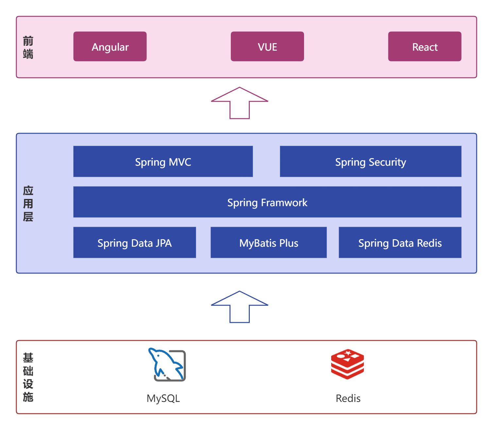
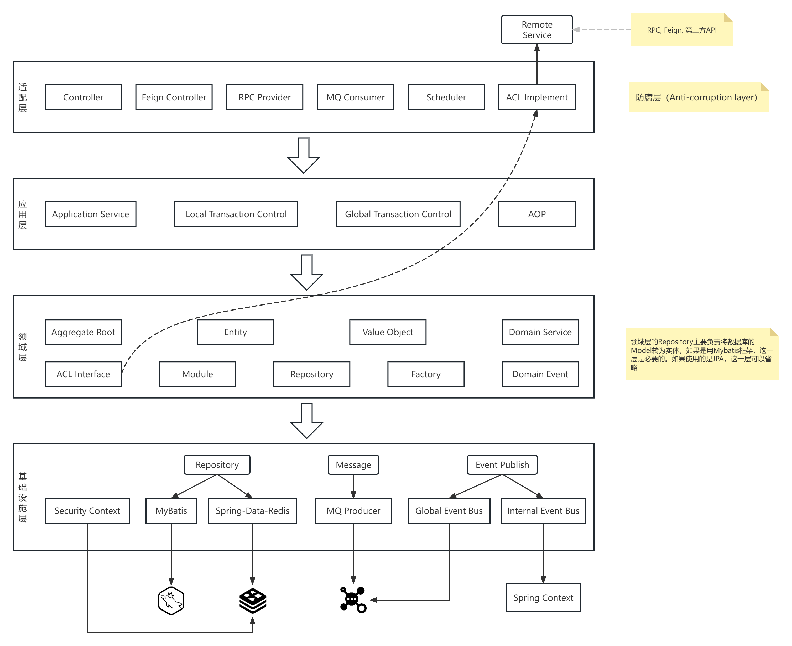

# darkblue-parent

    

### 介绍

文档地址：https://dblue.org/docs/project-docs/quick-start

### 软件架构

技术架构如下：

本系统开发时采用的是 DDD 架构，是对 DDD 的一次尝试。架构如下

### 安装教程

1. 初始化数据库脚本，数据库脚本在 `darkblue-parent/darkblue-application/src/main/resources/init.sql`。
2. 由于使用了 QueryDSL，在启动项目之前需要先编译代码 `mvn compile`
3. 修改数据库配置，配置文件在：`application-dev.yaml`
4. 启动项目

### 参与贡献

1.  Fork 本仓库
2.  新建 Feat_xxx 分支
3.  提交代码
4.  新建 Pull Request

